<!-- # coding-template -->

<!-- ## Summary

The summary can contain but is not limited to:

- Code structure.

- Commands to reproduce your experiments.

- Write-up of your findings and conclusions.

- Ipython notebooks can be organized in `notebooks`.
 -->

We covered the implementation and evaluation of these object detection models

- [Deformable Convolutional Networks, Dai, Qi, Xiong, Li, Zhang, Hu, Wei; 2017](https://arxiv.org/abs/1703.06211)

- [CornerNet: Detecting Objects as Paired Keypoints, Law, Deng; 2018](https://arxiv.org/abs/1808.01244)

- [Objects as Points , Zhou, Wang, Krähenbühl; 2019](https://arxiv.org/abs/1904.07850)

- [End-to-End Object Detection with Transformers,, Carion, Massa, Synnaeve, Usunier, Kirillov, Zagoruyko; 2020](https://arxiv.org/abs/2005.12872)

- [Deformable DETR: Deformable Transformers for End-to-End Object Detection , Zhu, Su, Lu, Li, Wang, Dai; 2020](https://arxiv.org/abs/2010.04159#)

## DATASETS

We evaluate our tasks on two datasets
### COCO 2017

This dataset contains about training/validation split of 118K/5K  and a total of 330k images including unannotated images that are labeled uniformly distributed across 80 classes.

- [Microsoft COCO: Common Objects in Context,2014](https://arxiv.org/pdf/1405.0312.pdf)

### PASCAL VOC 2012

This consists of 20 object categories with each image has pixel-level segmentation annotations, bounding box annotations, and object class annotations.training/validation split of 9717/1823 images.

- [PASCAL VOC (PASCAL Visual Object Classes Challenge)](http://host.robots.ox.ac.uk/pascal/VOC/voc2012/#data)

## CornerNet

To train and fine-tune a CornerNet model, we first downloaded a pre-trained CornerNet model from [princeton-vl/CornerNet](https://github.com/princeton-vl/CornerNet) github. According to the repository, this model had been trained on the PASCAL dataset, with the year unidentified, for 500k iterations. 

Using the instructions from the repo, such as installing conda and compiling NMS code, we specified the configuation files to load in this pre-trained model. The instructions originally set up the model to be trained on the COCO 2014 dataset and evaluated on the 2017 validation set. But, we changed the dataloader to instead load in the 2012 PASCAL trainval set.

The trainval set was split up into a training and validation set (~85% training, ~15% validation). We had 11,540 images in total, and 9,717 went to training and 1,823 went to validation. Using the TACC, we fine-tuned the pretrained CornerNet for 6,000 iterations ~30 epochs.

Below is the MAP (Mean Average Precision) on the validation data over 30 epochs.

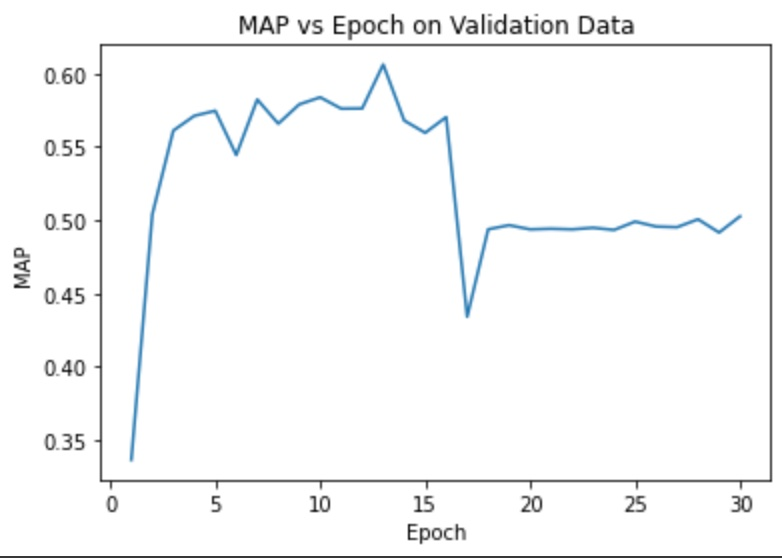

Below is the MAR (Mean Average Recall) on the validation data over 30 epoches.

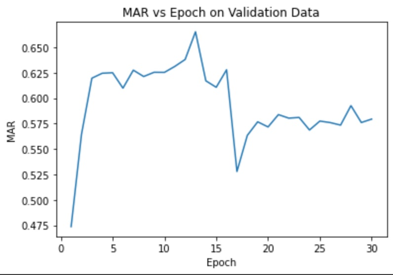

You can see that the CornerNet model started to overfit towards the latter half of the fine-tuning. At about the 13th epoch, the CornerNet achieved it's highest MAP and MAR. Still, the output for validation loss confirms overfitting.

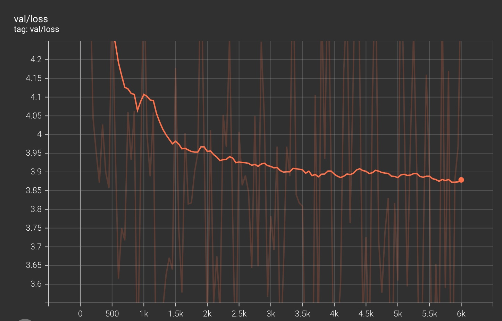

The solid line is the smoothed version, while the faded line is the actual validation loss.

Below is our training loss which did sparatically decrease through all 30 epochs.

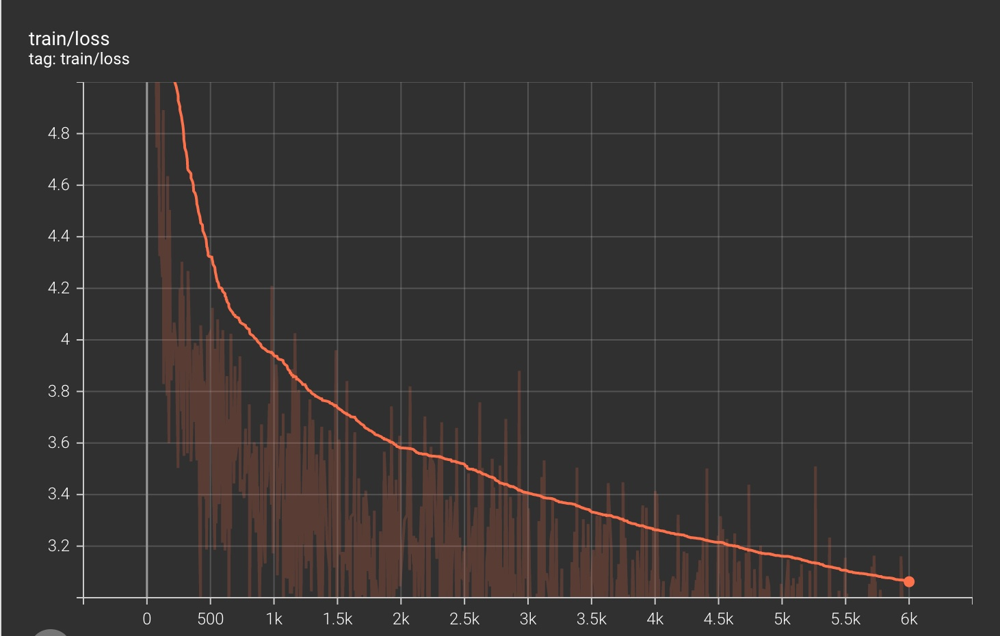

Below are the final AP and AR values from epoch 30.

| Evaluation Type | IoU | Area | MaxDets | Result |
| ----------- | --- | --- | --- | --- |
|Average Precision|  0.50:0.95 | all | 100| 0.5789
|Average Precision|  0.50 | all | 1000| 0.7527
|Average Precision|  0.75 | all | 1000|0.5862
|Average Precision|  0.50:0.95 | small | 1000|0.2317
|Average Precision|  0.50:0.95 | medium | 1000|0.5897
|Average Precision|  0.50:0.95 | large | 1000|0.6813
|Average Recall|  0.50:0.95 | all | 100|0.4696
|Average Recall|  0.50:0.95 | all | 300|0.6551
|Average Recall|  0.50:0.95 | all | 1000|0.7021
|Average Recall|  0.50:0.95 | small | 1000|0.4210
|Average Recall|  0.50:0.95 | medium | 1000|0.7439
|Average Recall|  0.50:0.95 | large | 1000|0.7755

## Deformable Convolutional Networks

OpenMMLab Github Repository: https://github.com/open-mmlab/

The following data are all pre-trained by OpenMMlab using the COCO 2017 dataset

### Loss during training
The following four models use the same backbone R-50-FPN
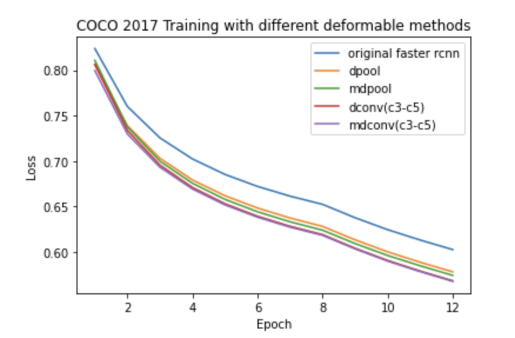

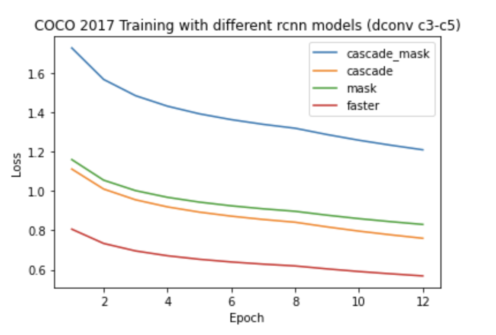
### faster rcnn r50
| Evaluation Type | IoU | Area | MaxDets | Result |
| ----------- | --- | --- | --- | --- |
|Average Precision|  0.50:0.95 | all | 100|0.374
|Average Precision|  0.50 | all | 1000|0.581
|Average Precision|  0.75 | all | 1000|0.404
|Average Precision|  0.50:0.95 | small | 1000|0.212
|Average Precision|  0.50:0.95 | medium | 1000|0.410
|Average Precision|  0.50:0.95 | large | 1000|0.481
|Average Recall|  0.50:0.95 | all | 100|0.517
|Average Recall|  0.50:0.95 | all | 300|0.517
|Average Recall|  0.50:0.95 | all | 1000|0.516
|Average Recall|  0.50:0.95 | small | 1000|0.326
|Average Recall|  0.50:0.95 | medium | 1000|0.557
|Average Recall|  0.50:0.95 | large | 1000|0.648

### dconv faster rcnn r50
| Evaluation Type | IoU | Area | MaxDets | Result |
| ----------- | --- | --- | --- | --- |
|Average Precision|  0.50:0.95 | all | 100|0.413
|Average Precision|  0.50 | all | 1000|0.624
|Average Precision|  0.75 | all | 1000|0.450
|Average Precision|  0.50:0.95 | small | 1000|0.246
|Average Precision|  0.50:0.95 | medium | 1000|0.449
|Average Precision|  0.50:0.95 | large | 1000|0.554
|Average Recall|  0.50:0.95 | all | 100|0.549
|Average Recall|  0.50:0.95 | all | 300|0.549
|Average Recall|  0.50:0.95 | all | 1000|0.549
|Average Recall|  0.50:0.95 | small | 1000|0.353
|Average Recall|  0.50:0.95 | medium | 1000|0.590
|Average Recall|  0.50:0.95 | large | 1000|0.698

### mdconv faster rcnn r50

| Evaluation Type | IoU | Area | MaxDets | Result |
| ----------- | --- | --- | --- | --- |
|Average Precision|  0.50:0.95 | all | 100|0.414
|Average Precision|  0.50 | all | 1000|0.625
|Average Precision|  0.75 | all | 1000|0.456
|Average Precision|  0.50:0.95 | small | 1000|0.246
|Average Precision|  0.50:0.95 | medium | 1000|0.452
|Average Precision|  0.50:0.95 | large | 100|0.542
|Average Recall|  0.50:0.95 | all | 100|0.548
|Average Recall|  0.50:0.95 | all | 300|0.548
|Average Recall|  0.50:0.95 | all | 1000|0.548
|Average Recall|  0.50:0.95 | small | 1000|0.359
|Average Recall|  0.50:0.95 | medium | 1000|0.587
|Average Recall|  0.50:0.95 | large | 1000|0.691

### dconv faster rcnn r50 dpool

| Evaluation Type | IoU | Area | MaxDets | Result |
| ----------- | --- | --- | --- | --- |
|Average Precision|  0.50:0.95 | all | 100|0.381
|Average Precision|  0.50 | all | 1000|0.597
|Average Precision|  0.75 | all | 1000|0.420
|Average Precision|  0.50:0.95 | small | 1000|0.224
|Average Precision|  0.50:0.95 | medium | 1000|0.415
|Average Precision|  0.50:0.95 | large | 100|0.494
|Average Recall|  0.50:0.95 | all | 100|0.522
|Average Recall|  0.50:0.95 | all | 300|0.522
|Average Recall|  0.50:0.95 | all | 1000|0.522
|Average Recall|  0.50:0.95 | small | 1000|0.334
|Average Recall|  0.50:0.95 | medium | 1000|0.559
|Average Recall|  0.50:0.95 | large | 1000|0.655

### dconv faster rcnn r50 mdpool

| Evaluation Type | IoU | Area | MaxDets | Result |
| ----------- | --- | --- | --- | --- |
|Average Precision|  0.50:0.95 | all | 100|0.379
|Average Precision|  0.50 | all | 1000|0.594
|Average Precision|  0.75 | all | 1000|0.418
|Average Precision|  0.50:0.95 | small | 1000|0.224
|Average Precision|  0.50:0.95 | medium | 1000|0.414
|Average Precision|  0.50:0.95 | large | 100|0.493
|Average Recall|  0.50:0.95 | all | 100|0.519
|Average Recall|  0.50:0.95 | all | 300|0.519
|Average Recall|  0.50:0.95 | all | 1000|0.519
|Average Recall|  0.50:0.95 | small | 1000|0.329
|Average Recall|  0.50:0.95 | medium | 1000|0.558
|Average Recall|  0.50:0.95 | large | 1000|0.652

- `dconv` and `mdconv` denote (modulated) deformable convolution, `c3-c5` means adding dconv in resnet stage 3 to 5. `dpool` and `mdpool` denote (modulated) deformable roi pooling.

| Backbone            | Model  | method | AP | AP50 | AP75 | APsmall| APmed | APlarge |
| :--               | :--       | :--  | :--    | :--  | :-- | :-- | :-- | :-- |
| R-50-FPN    | Faster  | -  |0.374 | 0.581   |0.404 |0.212 |0.410 |0.481 |
| R-50-FPN    | Faster | dconv(c3-c5) | 0.413 | 0.624 |0.450| 0.246 | 0.449 | 0.554|
| R-101-FPN    | Faster | dconv(c3-c5) | 0.427 | 0.637 |0.468| 0.249 | 0.467 | 0.568|
| R-50-FPN | Faster  | mdconv(c3-c5)  |0.414| 0.625 |0.456    |0.246 |0.452 |0.542 |
| R-50-FPN | Faster | dpool  | 0.381 | 0.597 | 0.420 | 0.224 | 0.415 | 0.494|
| R-50-FPN| Faster  |mdpool |0.379 | 0.594   |0.418 |0.224 |0.414 |0.493 |
| R-50-FPN | Mask | dconv(c3-c5) | 0.418| 0.627| 0.462|0.245|0.453 | 0.554|
| R-50-FPN | Cascade | dconv(c3-c5) | 0.438| 0.626|0.479|0.263|0.472|0.585|

| Backbone            | Model  | method | AR100 | AR300 | AR1000 | ARsmall| ARmed | ARlarge |
| :--               | :--       | :--  | :--    | :--  | :-- | :-- | :-- | :-- |
| R-50-FPN    | Faster  | -  |0.517 | 0.517   |0.516 |0.326 |0.557 |0.648 |
| R-50-FPN    | Faster | dconv(c3-c5) | 0.549 | 0.549 |0.549| 0.353 | 0.590 | 0.698|
| R-101-FPN    | Faster | dconv(c3-c5) | 0.557 | 0.557 |0.557| 0.354 | 0.602 | 0.708|
| R-50-FPN | Faster  | mdconv(c3-c5)  |0.548| 0.548 |0.548    |0.359 |0.587 |0.691 |
| R-50-FPN | Faster | dpool  | 0.522 | 0.522 | 0.522 | 0.334 | 0.559 | 0.655|
| R-50-FPN| Faster  |mdpool |0.519 | 0.519   |0.519 |0.329 |0.558 |0.652 |
| R-50-FPN | Mask | dconv(c3-c5) | 0.551|0.551|0.551|0.356|0.590|0.704
| R-50-FPN | Cascade | dconv(c3-c5) | 0.571 | 0.571|0.571|0.369|0.608|0.728

### Classification example
faster rcnn r50
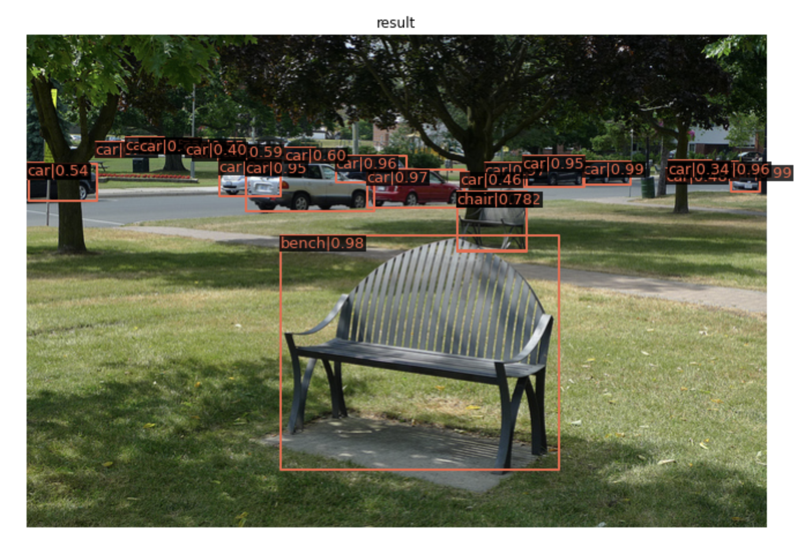
dconv faster rcnn r50
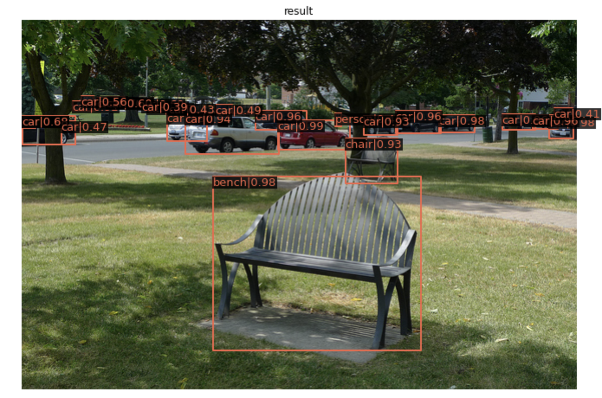

## Deformable DETR
## Training on PASCAL VOC

Training with 5 epochs on Pascal VOC datasets with 70 number of queries.

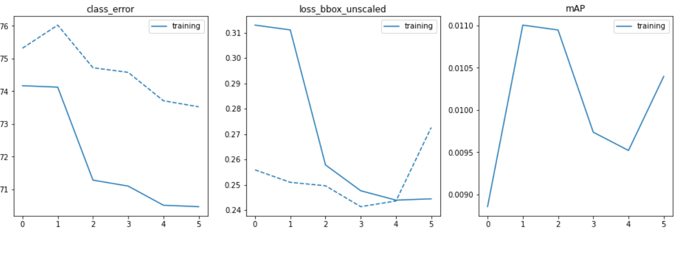

<!-- Validation -->

## Evaluation with pre-trained model on COCO 2017

We evaluated on three variants of the model Deformable DETR basic, the single-scale meaning only using res5 feature map (of stride 32) as input feature maps for Deformable Transformer Encoder and the single-scale DC5 means the stride in C5 stage of ResNet and add a dilation of 2 instead.
The epoch was varied from 50-500 across all three models there was no observable changes in both evaluation loss, average precision and average recall for all three models used.

Due to constraint in time to train evaluated on model on coco 2017 datasets comparing the single-scale,single-scale-dc5 and the base detr model.
### Deformable DETR Single-Scale DC5

Average Precision 

| Epoch | Loss | AP | AP50 | AP75 | APsmall| APmed | APlarge |
| :--  | :--   | :--  | :-- |:--  |:--  |:-- |:-- |
| 50   | 6.2433 | 0.414 | 0.618 |0.449|0.237|0.453|0.560

Average Recall 

| Epoch | Loss | AR1 | AR10 | AP100 | ARsmall| ARmed | ARlarge |
| :--  | :-- | :--  | :--  |:-- |:-- |:--  |:-- |
| 50   | 6.2433| 0.340 | 0.556|0.571|0.373 |0.624|0.803

### Deformable DETR Single-Scale

Average Precision  

| Epoch | Loss | AP | AP50 | AP75 | APsmall| APmed | APlarge |
| :--  | :--   | :--  | :-- |:--  |:--  |:-- |:-- |
| 50 | 6.2165 | 0.394 | 0.597|0.422|0.207|0.430 |0.559 |

Average Recall

| Epoch | Loss | AR1 | AR10 | AP100 | ARsmall| ARmed | ARlarge |
| :--  | :--   | :--  | :-- |:--  |:--  |:-- |:-- |
| 50  | 6.2165| 0.326 | 0.534|0.571|0.328 |0.624 |0.800|

### Deformable DETR

Average Precision

| Epoch | Loss | AP | AP50 | AP75 | APsmall| APmed | APlarge |
| :--  | :--   | :--  | :-- |:--  |:--  |:-- |:-- |
| 50  | 5.8611 | 0.445 | 0.635 |0.487 |0.268 |0.477 |0.595 |

Average Recall

| Epoch | Loss | AR1 | AR10 | AP100 | ARsmall| ARmed | ARlarge |
| :--  | :--   | :--  | :-- |:--  |:--  |:-- |:-- |
| 50  | 5.8611 | 0.353 | 0.587 |0.629 |0.416 |0.673 |0.819 |

Comparison by changing the convolution backbone of ResNet-50 vs ResNet-101

| Method             | Backbone   | loss | AP | AP50 | AP75 | APsmall| APmed | APlarge |
| :--               | :--       | :--  | :--    | :--  | :-- | :-- | :-- | :-- |
| Deformable DETR    | ResNet-50  | 5.8611  |0.445 | 0.635   |0.487 |0.268 s|0.477 |0.595 |
| Deformable DETR    | ResNet-101 | 16.5243 | 0.069 | 0.115 |0.073| 0.063 | 0.092 | 0.051 |
| Deformable DETR-SS | ResNet-50  | 6.2165   |0.394 | 0.597   |0.422    |0.207 |0.430 |0.559  |
| Deformable DETR-SS | ResNet-101 | 18.5253  |0.052 | 0.106 | 0.044 | 0.028 | 0.077 | 0.062 |
| Deformable DETR-DC5| ResNet-50  |6.2433 |0.414 | 0.618   |0.449 |0.237 |0.453 |0.560 |
| Deformable DETR-DC5| ResNet-101 |17.3633  |0.057 | 0.119 | 0.048 | 0.048 | 0.079 | 0.045 |

Observed high evaluation loss when the backbone in contrast to the backbone used to train initially.This maybe due the weights initialization at training time that causes bad performance during evaluation.

## Center Net

Problems with training center-net. 
The centernet code requires pytorch 0.4.1 or 0.4.0 to run. Later versions of pytorch do not support center-net. Pytorch 0.4.1/0.4.0 do not run on cuda versions higher than 9. 
I installed cuda 9.0 in frontera and I also installed pytorch 0.4.1. 

# Training / Fine-tuning on Pascal VOC 2012
This consists of 20 object categories with each image has pixel-level segmentation annotations, bounding box annotations, and object class annotations.
In this project, we split the dataset into 9717 training images and 1823 validation images.

We consider the following model setups:

## Training from scratch:

* DETR
    + Backbone ResNet-50
    + Backbone ResNet-101
* Deformable DETR 
    + Backbone ResNet-50
    + Backbone ResNet-101

Deformable DETR is trained much faster than DETR, as highlighted in the paper. We trained 300 epochs for DETR and 200 epochs for Deformable DETR. Even after 300 epochs, the classification error of both DETR ResNet-50 and ResNet-101 models are still high. Deformable models achieve much better acccuracy. All models achieved roughly over 0.4 MAP. 

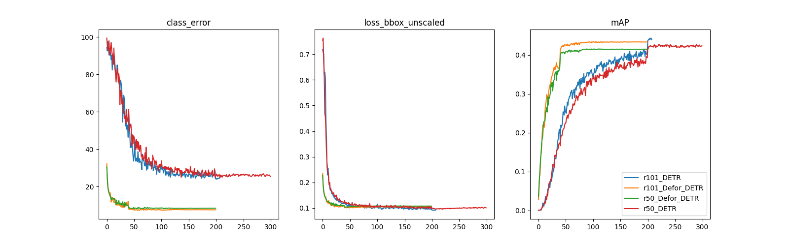 

| Method             | Backbone   | AP | AP50 | AP75 | APsmall| APmed | APlarge |
| :--                | :----------      | :--    | :--  | :-- | :-- | :-- | :-- |
| DETR               | ResNet-50        | 0.461 | 0.687 |0.484 |0.067 |0.261 |0.580 |
| DETR               | ResNet-101       | 0.480 | 0.702 |0.508 |0.073 |0.280 |0.595 |
| Deformable DETR    | ResNet-50        | 0.433 | 0.681 |0.468 |0.103 |0.270 |0.531 |
| Deformable DETR    | ResNet-101       | 0.458 | 0.709 |0.491 |0.076 |0.303 |0.561 |

## Fine-tuning from the pre-trained weights from COCO dataset. 

* DETR
    + Backbone ResNet-50
    + Backbone ResNet-50 + DC5 (dilation)
    + Backbone ResNet-101
* Deformable DETR 
    + Backbone ResNet-50
    + Backbone ResNet-50 + Iterative Refinement Box
    + Backbone ResNet-50 + DC5 

We compared the fine-tuning results of DETR and Deformable DETR on the PASCAL VOC 2012 dataset, too. The weights are pretrained on COCO dataset. We finetuned all models for 20 epochs. Iterative refinement is the most effective trick to improve average precision. For VOC dataset, dilation is not working as well as DETR reported on COCO. 

| Method             | Backbone   | AP | AP50 | AP75 | APsmall| APmed | APlarge |
| :--                | :----------      | :--    | :--  | :-- | :-- | :-- | :-- |
| DETR               | ResNet-50        | 0.575 | 0.776 |0.618 |0.159 |0.402 |0.683 |
| DETR-DC5           | ResNet-50        | 0.580 | 0.772 |0.622 |0.156 |0.395 |0.689 |
| DETR               | ResNet-101       | 0.591 | 0.778 |0.643 |0.155 |0.405 |0.700 |
| Deformable DETR    | ResNet-50        | 0.581 | 0.790 |0.650 |0.192 |0.420 |0.675 |
| Deformable DETR-DC5| ResNet-50        | 0.565 | 0.781 |0.628 |0.190 |0.430 |0.663 |
| Deformable DETR-Iterative| ResNet-50  | 0.621 | 0.802 |0.679 |0.220 |0.466 |0.714 |

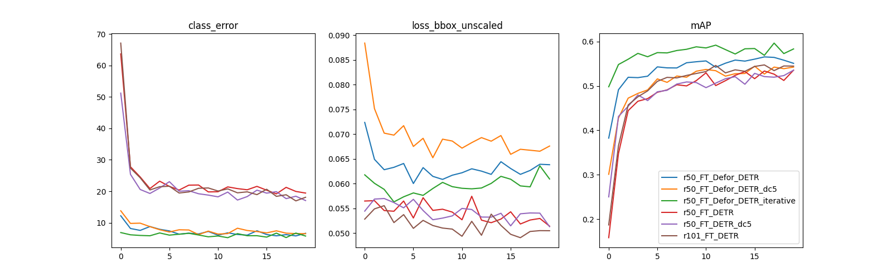 

## Reference

[Deformable-DETR](https://github.com/fundamentalvision/Deformable-DETR)

[Center Net](https://github.com/xingyizhou/CenterNet)